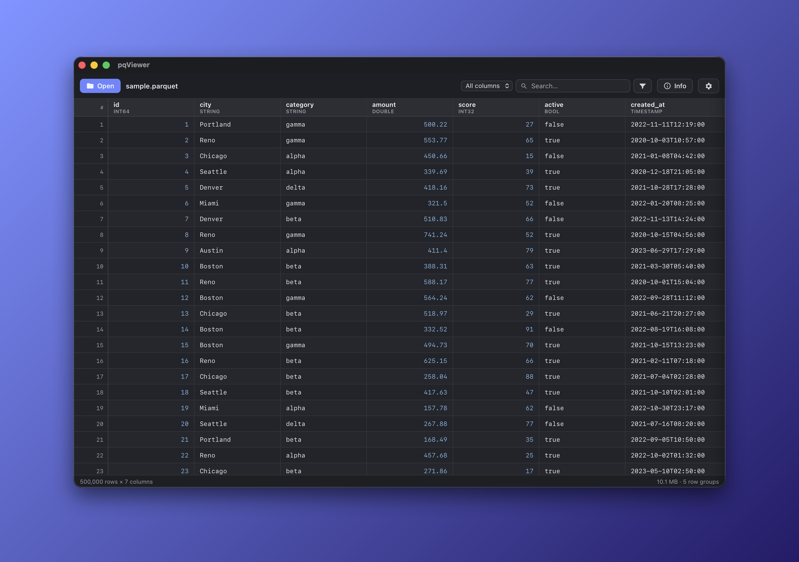

<h1 align="center">ParquetView</h1>

<p align="center">A fast, native macOS viewer for Apache Parquet files.</p>

<p align="center">
  <a href="https://github.com/Alyetama/ParquetView/releases/latest/download/ParquetView.dmg"><b>⬇️ Download for macOS</b></a>
  &nbsp;·&nbsp;
  <a href="https://alyetama.github.io/ParquetView">Website</a>
  &nbsp;·&nbsp;
  <a href="#first-launch">First launch</a>
</p>

<p align="center">
  
</p>

## Download

**[⬇️ Download ParquetView for macOS](https://github.com/Alyetama/ParquetView/releases/latest/download/ParquetView.dmg)** (Apple Silicon)

Open the `.dmg`, drag **ParquetView** to Applications, then follow [First launch](#first-launch) below.

## Features

- **Opens huge files instantly** — reads only the row groups on screen, so multi‑gigabyte files scroll smoothly without loading into memory.
- **Open any way** — file picker, drag‑and‑drop, or Finder's "Open With".
- **Typed columns** and a metadata panel (rows, schema, file size, compression codec, row‑group count, writer, format version).
- **Sort** any column, ascending or descending.
- **Search & advanced filters** — quick substring search, or build multi‑condition filters (contains, equals, regex, `>`/`<`, is‑empty…) combined with AND/OR.
- **Select or edit a cell** — double‑click to copy a value or tweak it inline.
- **Settings** — Light/Dark/Auto theme, row density, and font size, saved between launches.

## First launch

ParquetView isn't signed with an Apple Developer ID, so macOS blocks it the first time. This is expected — open it with **one** of these:

1. **Right‑click to open.** In Finder, **right‑click** (or Control‑click) **ParquetView** → **Open** → **Open**.
2. **If that's blocked on newer macOS:** open **System Settings → Privacy & Security**, scroll down, and click **Open Anyway** next to the ParquetView message.
3. **Terminal fallback:** remove the quarantine flag, then open normally:
   ```bash
   /usr/bin/xattr -dr com.apple.quarantine /Applications/ParquetView.app
   ```

## Build from source

Requires Rust, Node 18+, and Xcode command‑line tools.

```bash
npm install
npm run tauri build   # → src-tauri/target/release/bundle/macos/ParquetView.app
```

For development with hot reload: `npm run tauri dev`.

Built with [Tauri](https://tauri.app) (Rust backend + web frontend); Parquet reading uses the `arrow`/`parquet` crates.

## License

[MIT](LICENSE) © 2026 Alyetama
